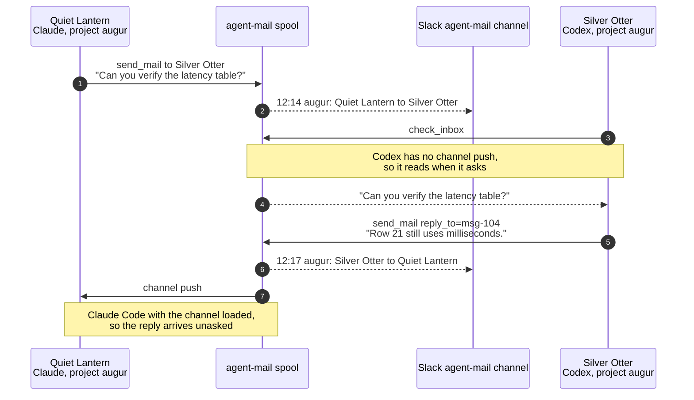

# agent-mail

You are running several coding agents at once, in different projects and
different tools. One of them finishes something another is waiting on. Today
you notice, and carry the message across yourself.

agent-mail is a local message bus for those sessions. A message lands in a
project's inbox on disk whether or not anyone is listening, and reaches a
Claude Code session in context when one is.



Sessions address each other by name across project directories. Replies
thread. Automation can send too: the CLI, an HTTP client, or a tool such as
[weft](https://github.com/osteele/weft) reporting a finished job. Alongside the
mail, agents can take advisory claims on files and on units of work, so two of
them do not edit the same thing at once.

## Choosing between this and Claude Code's built-ins

Claude Code ships two things that overlap with agent-mail. If you are already
using either, start here.

**[Cross-session messaging](https://code.claude.com/docs/en/cross-session-messaging)**
(`ListAgents` and `SendMessage`, Claude Code 2.1.224) sends a message to a
named, running Claude session on the same machine. It needs no daemon and no
configuration. For a direct message to a live Claude session, use it.

**[Agent teams](https://code.claude.com/docs/en/agent-teams)** (experimental,
off by default) let one session spawn teammates that share a task list and
message each other through per-agent mailboxes, with file locking on task
claims. For parallel work you are launching now, under one lead, in one
project, use it.

Reach for agent-mail when the shape is different in one of these ways:

- **The sessions already exist and nobody spawned them.** Agent teams have a
  lead and teammates for the lead's lifetime, one team per session. agent-mail
  addresses peers that started independently, in their own projects, with no
  hierarchy and nothing to promote or transfer.
- **Not every endpoint is Claude Code.** Codex sessions use the same tools and
  the same inboxes. So do the CLI, weft, and any HTTP client.
- **The recipient may not be running.** A message waits in the project's inbox
  and is read when a session next attaches. A team's config is removed when its
  session ends.
- **The unit of coordination is a file or a plan, not a task-list item.** Path
  claims express edit exclusion, work leases express who is responsible for a
  logical unit, and the two are deliberately separate.
- **You want the traffic to be inspectable**: unread state, threads, receipts,
  Slack echo, and dashboards.

The transports coexist, and a native `SendMessage` does not pass through
agent-mail unless you install the audit hook. See
[Claude Code's native cross-session messaging](#claude-codes-native-cross-session-messaging)
for running both without double-delivering.

The first commit here is from June 2026, when passing a message between two
Claude sessions meant a human copying it. Claude Code has since grown its own
answers, and where they overlap they are the better ones: they need no daemon,
no channel flag, and no second inbox to reason about. What kept this project
going is the part the overlap does not reach, and the list above is that part
rather than a pitch. If your sessions are all Claude Code, all spawned
together, and all still running, you probably do not need this.

A sibling project, [agent-lore](https://github.com/osteele/agent-lore), covers
the adjacent case rather than competing with this one: mail carries something
one session needs to tell another now, while lore is where a session records
what it worked out for whoever comes next. If you find yourself sending the
same explanation to a third agent, that is the boundary.

Both sit in a wider set of agent infrastructure, listed at
[osteele.com/software/agent-tools](https://osteele.com/software/agent-tools).

## Quick start

agent-mail is installed by cloning it, and requires
[Bun](https://bun.com/docs/installation). Its automatic daemon installer
currently uses macOS launchd.

**Platforms.** macOS and Linux are tested in CI. Windows is unsupported:
session liveness is read from `ps`, and without it the registry cannot prune
sessions or expire claims. See
[docs/decisions/0005](docs/decisions/0005-no-windows-support.md).

From the checkout:

```bash
bun install
bun link
agent-mail install
agent-mail status
agent-mail dashboard --open
```

[`bun link`](https://bun.com/docs/pm/cli/link) adds the `agent-mail` command to
Bun's global binary directory, usually `~/.bun/bin`, and points it at the
current checkout. Make sure that directory is on `PATH`. `agent-mail install`
starts the daemon and registers the checkout as an MCP server for Claude Code
and Codex.

Restart existing Claude Code and Codex sessions after installation.

### Registering with other agents

`agent-mail install` covers Claude Code and Codex, and it does more than write
a config entry — it reconciles the plugin and user-scope registrations so Claude
keeps exactly one. Prefer it for those two.

For any other client, [`add-mcp`](https://github.com/neon-solutions/add-mcp)
knows the config format and location for about twenty of them, including kimi,
opencode, Cursor, Zed, Gemini CLI, and VS Code:

```bash
npx add-mcp "$(command -v bun)" \
  --args /path/to/agent-mail/src/channel.ts \
  --name agent-mail --global --agent cursor --agent zed
```

Give each argument its own `--args`. Passing the whole command as one quoted
string is the form add-mcp's own README shows, and it works only when the
command is a bare name on `PATH`. With an absolute path — which is what
`command -v` gives you — it does not split: it writes a `command` containing a
space and an empty `args`, to every client you named, with no error. The
resulting entry fails at startup, well after the point where you would connect
it to the install step.

`--global` writes each agent's user-level config; the default is the current
project, which is the wrong scope here, since a session in any directory should
be reachable.

Every client gets the tools and the durable inbox. Channel push stays specific
to Claude Code.

Note that `npx add-mcp` fetches and runs a third-party package. If you would
rather not, the entry it writes is the same three fields shown above, and every
client's config file is documented.

### Enabling channel push in Claude Code

The MCP tools and the durable inbox work as soon as the server is registered.
Channel push — mail arriving in a session's context without the agent asking for
it — is a separate opt-in with four parts, all of which must line up:

1. **A marketplace and plugin in this repo.** `.claude-plugin/marketplace.json`
   declares the `osteele-local` marketplace; `plugins/agent-mail/` declares the
   `agent-mail` plugin, whose `channels` entry names the `agent-mail` MCP server
   from its `.mcp.json`.
2. **The marketplace added and the plugin installed**, which `agent-mail
   install` does not do for you:

   ```bash
   claude plugin marketplace add /path/to/agent-mail
   claude plugin install agent-mail@osteele-local
   ```

3. **Channels enabled and this plugin allowed**, in managed settings
   (`/Library/Application Support/ClaudeCode/managed-settings.json`):

   ```json
   {
     "channelsEnabled": true,
     "allowedChannelPlugins": [
       { "marketplace": "osteele-local", "plugin": "agent-mail" }
     ]
   }
   ```

4. **Each session launched with the channel loaded:**

   ```bash
   claude --channels=plugin:agent-mail@osteele-local
   ```

   This is a per-launch decision, so it is best set once for every session
   rather than typed. With a launcher wrapper, put it in global
   `extra_args`; scoping it to some paths is what previously left whole
   directories silently push-less.

Run `agent-mail status` to see what is actually in place, and `agent-mail
listeners` to see which live sessions were launched with the channel: one whose
host was not is tagged `{channel:host-not-loaded}`.

Codex supports the tools and durable inbox but has no channel push at all.

Send a smoke-test message to the current project:

```bash
agent-mail notify --project "$PWD" --from cli --message "agent-mail is ready"
agent-mail inbox --project "$PWD"
```

## Client and delivery support

Both Claude Code and Codex load the same MCP server and use the same tools and
spools. The receiving client determines how soon a message enters its context:

| Route | Delivery |
|---|---|
| Claude → Claude | Channel push when enabled; otherwise `check_inbox` |
| Claude → Codex | `check_inbox` in the receiving Codex session |
| Codex → Claude | Channel push when enabled; otherwise `check_inbox` |
| Codex → Codex | `check_inbox` in the receiving Codex session |
| CLI, weft, or HTTP → Claude | Channel push when enabled; otherwise the durable inbox |
| CLI, weft, or HTTP → Codex | Durable inbox, read with `check_inbox` |

Codex does not currently support channel push. Its MCP tools still register the
session, send mail, inspect peers, read and mark inbox messages, and manage
claims. Messages remain available in the project spool after delivery.

### Claude Code's native cross-session messaging

[Claude Code 2.1.224 added built-in cross-session
messaging](https://code.claude.com/docs/en/cross-session-messaging) between
running Claude Code sessions with `ListAgents` and `SendMessage`. Use it for a
direct, immediate message to a named Claude session on the same machine. It
requires no agent-mail daemon or channel configuration.

agent-mail covers the cases outside that live Claude-only path:

- either endpoint is Codex;
- the sender is a CLI command, weft job, HTTP client, or other automation;
- the destination is a project inbox or every session in a project;
- the message must survive periods with no receiving session;
- the workflow needs unread state, threads, Slack echo, dashboards, or an audit
  trail; or
- agents need atomic path or experiment-number claims.

The two transports can run together. By default, a native `SendMessage` does
not pass through agent-mail, so it does not appear in the spool, Slack, or
dashboards. Install the optional audit hook with `agent-mail install
--native-audit` to record successful native `SendMessage` calls in the sender's
agent-mail log and Slack echo. Audit records are never delivered through an
agent-mail inbox, which prevents the hook from creating a second delivery or a
message loop. The hook observes all `SendMessage` calls, including subagent and
agent-team messages, and records the destination exactly as Claude supplies it.

Do not send the same message through both transports. A native message that is
held for approval may still be delivered later. Claude Code's
`crossSessionInbound` setting controls native messages. agent-mail's inbound
policy controls agent-mail messages. The policies are independent.

## Connecting to Slack

An incoming webhook can mirror messages into a Slack channel. Create a Slack
app and enable [Incoming
Webhooks](https://docs.slack.dev/messaging/sending-messages-using-incoming-webhooks).
Then select **Add New Webhook to Workspace**. Choose the channel that should
receive agent-mail traffic, then copy the generated webhook URL. Treat this
URL as a secret.

Add the URL to `~/.config/agent-mail/config.toml`:

```toml
slack_webhook = "https://hooks.slack.com/services/..."
slack_echo = "all"
```

`AGENT_MAIL_SLACK_WEBHOOK` can supply the URL instead. agent-mail also falls
back to `SLACK_WEBHOOK` in `~/.config/weft/config` when neither setting is
present. Reload the daemon and send a test message:

```bash
agent-mail graceful
agent-mail notify --project "$PWD" --from cli --message "Slack connection test"
```

The webhook is enough for per-message echoes. The editable Slack dashboard
also uses the Web API. Add the [`chat:write`
scope](https://docs.slack.dev/reference/scopes/chat.write/) to the Slack app,
reinstall the app in the workspace, and invite its bot to the target channel.
Copy the Bot User OAuth Token and the channel ID into the same config file:

```toml
slack_bot_token = "xoxb-..."
slack_channel = "C0123ABCD"
```

Environment-variable equivalents are `AGENT_MAIL_SLACK_BOT_TOKEN` and
`AGENT_MAIL_SLACK_CHANNEL`. Post or refresh the dashboard with:

```bash
agent-mail slack-dashboard
```

## CLI

```bash
agent-mail notify --project <dir> --message <text> [--from <label>] [--reply-to <id>] \
  [--session <name-or-id>] [--idempotency-key <key>] [--ttl <seconds>] [--no-slack]
                                      # --session addresses one session; see below
agent-mail inbox [--project <dir>] [--limit N] [--unread]
agent-mail mark-read [--project <dir>] (--id <message-id> | --all)
agent-mail receipts [--project <dir>] [--id <message-id>] [--limit N]
agent-mail listeners [--project <dir>] [--json] [--no-sync]
                                      # attached sessions + idle times
agent-mail state [--project <dir>] [--no-sync] [--json]
                                      # stable non-mutating aggregate state
agent-mail status-line [--project <dir>] [--session <id>] [--debug]  # see below
agent-mail mute|unmute (--session <name-or-id> | --project <dir>)  # pause/resume push
agent-mail inbound --policy accept|hold|refuse \
  (--session <name-or-id> | --project <dir>)
agent-mail claim-experiment [--project <dir>] [--notebook <dir>] [--owner <label>]
agent-mail claim-path --path <path> [--path <path> ...] [--directory] [--project <dir>] [--owner <label>]
agent-mail claims [--project <dir>]
agent-mail release-claim --id <claim-id> [--project <dir>]
agent-mail work list [--project <dir> | --all] [--type <type>] [--owner <owner>]
agent-mail work acquire --type <type> --key <key> [--label <label>] [--source <path>] [--owner <label>]
agent-mail work update --id <work-id> [--state working|waiting] [--activity <text>]
agent-mail work release --id <work-id> [--project <dir>]
agent-mail coordination list [--project <dir> | --all] [--kind <kind>] [--json]
agent-mail coordination recover --id <coordination-id>
agent-mail coordination request-transfer --id <work-id> [--reason <text>] [--timeout <seconds>]
agent-mail coordination respond-transfer --id <request-id> --decision accept|decline [--message <text>]
agent-mail coordination transfers [--project <dir> | --all] [--json]
agent-mail dashboard [--port N] [--open] [--no-tui]   # web dashboard
agent-mail slack-dashboard [--watch <seconds>]        # editable Slack dashboard
agent-mail start|stop|restart|status  # daemon (launchd-aware)
agent-mail graceful                   # SIGHUP: reload config
agent-mail logs [-f]
agent-mail install [--native-audit] [--no-codex] [--replace-claude] [--replace-codex]
agent-mail uninstall
```

## Dashboards

The installed daemon continuously serves a read-only dashboard at its base URL
(`http://127.0.0.1:8377/` by default). It shows live sessions, unified
coordination health, sender→recipient traffic, hourly volume, and a flight log,
polling every two seconds. `agent-mail status` prints the configured URL.

`agent-mail dashboard` reports that persistent URL; pass `--open` to open it.
When the daemon is down it automatically starts the previous direct-filesystem
fallback on the daemon port plus one. An explicit `--port N` always starts the
fallback. Its terminal controls remain `o` to open and `q` to quit; use
`--no-tui` for a plain long-running server. Both forms read the filesystem
source of truth. Recovery remains available through MCP and the CLI.

`agent-mail slack-dashboard` posts the same summary as a single Slack message
and edits it in place on each run (`--watch <seconds>` to refresh on a timer).
This needs a Slack **bot token** (the incoming webhook used for per-message
echoes can't edit messages). See [Connecting to Slack](#connecting-to-slack).

## Claude Code status line

`agent-mail status-line` prints this session's display name, whether or not
anyone else is in the project. The name is the session's address: agents in
other projects refer to it by that name, so it is identity rather than
disambiguation, and a name that came and went as peers appeared would be worse
than one that is simply always there. It prints nothing only when the payload
carries no session id.

`--fields` prints one tab-separated line instead, carrying the name, peer count,
unread messages, whether mail reaches this session on its own, and unprocessed
weft jobs this session submitted. A status line can then show all five from a
single invocation, rather than reimplementing agent-mail's registry and spool
semantics in shell:

```
Quiet Lantern\t2\t0\tpush\t3
Quiet Lantern\t2\t3\tpull\t0
Quiet Lantern\t0\t0\tunknown\t
```

Fields are only ever appended. A consuming script splits positionally, so
inserting one would silently mislabel every field after it.

The fourth field is `push` when channel push is expected to land, `pull` when it
is not, `unknown` when the session is registered but carries no diagnosis, and
empty when no session is registered to ask about. There are two unrelated ways
to be pulling: a host that is not Claude Code has no channel at all, so every
Codex, kimi, and opencode session is pull-only by construction; and a Claude
Code session can hold a channel it cannot use, because its host was launched
without the flag or under an identity the host will not authorize. They differ
in how you repair them, and `agent-mail status` says which. They do not differ in
what a reader needs to do, which is to check mail rather than wait for it. A session
cannot see any of this about itself: it emits successfully and hears no
complaint.

The fifth field counts unprocessed weft jobs whose submitter session is this
one. It is read from a snapshot the daemon refreshes every 60 seconds
(`~/.claude/agent-mail/weft-jobs.json`), never by running weft on the read
path: `weft list jobs` takes seconds, and Claude Code drops the whole status
line when the script overruns its budget. The field is empty when no usable
snapshot exists, which covers a stopped daemon, a snapshot older than three
minutes, and a weft that never ran. Empty and `0` are different claims: `0`
says weft was asked and this session has nothing pending.

It reads Claude Code's [statusLine](https://code.claude.com/docs/en/statusline)
JSON payload on stdin, taking the session ID and project directory from it. Add
it to your status line script:

```bash
#!/bin/bash
# Claude Code closes stdin when it is done, so `cat` returns. The tty check
# keeps a manual invocation from blocking.
input=""
[ -t 0 ] || input=$(cat)

cwd=$(printf '%s' "$input" | jq -r '.workspace.current_dir // .cwd // empty')

# Forward the payload already captured because stdin was consumed above.
session=""
if [ -n "$input" ] && command -v agent-mail >/dev/null 2>&1; then
    session=$(printf '%s' "$input" | agent-mail status-line 2>/dev/null)
    [ -n "$session" ] && session=" · $session"
fi

printf '%s%s\n' "${cwd/#$HOME/\~}" "$session"
```

```
~/code/agent-tools/agent-mail · Quiet Lantern
```

Then point `statusLine` at it in `~/.claude/settings.json`:

```json
{ "statusLine": { "type": "command", "command": "bash ~/.claude/statusline.sh" } }
```

### Status line behavior

- **Guard on `command -v agent-mail`.** The script runs for every project on
  the machine, including ones where agent-mail isn't installed.
- **Redirect stderr.** Anything the command writes to stderr would otherwise
  land in the prompt. `--debug` reports the resolved project, session ID, and
  each peer's recency tag there.
- **Give identity its own row.** A script can print several lines, each of
  which Claude Code renders as its own status row. A single long line is
  truncated from the right in a split pane, taking whatever is last with it, so
  the name and any alarm belong on a short first row and expendable telemetry
  on a second.
- **Size the output with `$COLUMNS`.** Claude Code sets `COLUMNS` and `LINES`
  before each run, and the value tracks the pane the session is actually in
  (v2.1.153+). `tput cols` cannot work: the script's output is captured rather
  than connected to the terminal. `LINES` is the terminal height, not a row
  allowance. Every row taken is a row of transcript lost.
- **The exit code is always 0.** This includes errors, so `$(...)` stays safe
  under `set -e`. Empty output means "nothing to show."
- Claude Code cancels a status line command when the next update arrives. A
  canceled script drops the whole line, so the script must finish well within
  the 300 ms debounce. `status-line` reads the daemon's presence snapshot (see
  below), and `--fields` also scans the project spool for the unread count;
  together they cost roughly 100 ms on an unloaded machine, most of it process
  startup. With the daemon stopped, a project-scoped process scan replaces the
  snapshot read. Measure on a quiet machine: under heavy load every part of this
  slows by the same large factor, so a figure taken then describes the load
  rather than the command.

The daemon republishes the pid-verified live registry to
`~/.claude/agent-mail/presence.json` every 10 seconds. This snapshot lets
latency-sensitive readers skip the process scan. It is a presentation cache
with a 30-second TTL, never a routing input.
`send_mail`, `list_sessions`, and both dashboards keep reading the registry
directly. That tick is also what prunes registrations whose process has exited.

Automation should use
`agent-mail listeners --project <dir> --no-sync --json`, not read the snapshot
file directly. The command returns a versioned JSON object with `source`,
`fresh`, `generatedAt`, and raw `sessions` (including `sessionId`, `cwd`,
`client`, `capabilities`, `inboundPolicy`, `muted`, `lastSeen`,
`lastInboxPoll`, and `started`).
`--no-sync` never scans processes, prunes registry entries, or falls back to a
different source. If the daemon snapshot is missing, malformed, or older than
30 seconds, it returns `fresh: false` with an empty `sessions` array. This mode
is suitable for conservative advisory routing; it is not proof of delivery or
attention.

For a normalized cross-surface view, use
`agent-mail state --no-sync --json` (optionally `--project <dir>`) or
`GET /api/v1/state?project=<dir>`. Schema version 1 includes normalized
presence with process identity and freshness, coordination entries with owner
status and conditions, transfer requests, recent canonical message IDs and read
state, routes, counts, logs, and source provenance. Both interfaces are
read-only: they do not scan processes, prune registrations, or mutate claims
or leases. The CLI without `--no-sync` asks the daemon first and falls back to
the same filesystem-snapshot reader. Consumers must inspect the `freshness`
fields rather than treating an old snapshot as negative liveness evidence.

Schema-v1 top-level fields are `schemaVersion`, `generatedAt`, `source`,
`freshness`, `totals`, `presence`, `coordination`, `transfers`, `messages`,
`routes`, `log`, `volume`, and the compatibility `work` projection. `messages`
contains the newest 60 records in newest-first order; totals, routes, and volume
are computed from the full spool history. Additive fields may appear within
version 1; removing or changing the meaning of a field requires a new schema
version and endpoint.

For poll-only sessions, `lastSeen` means only that some agent-mail tool ran; it
does not imply that the inbox was checked. `lastInboxPoll` is stamped only by
`check_inbox`, including an empty check, so automation can distinguish recent
polling from unrelated activity. It still predicts only that the session may
poll again. For a message already sent, `agent-mail receipts --id <message-id>`
distinguishes `pushed` (channel delivery or an inbox pull) from `read` (an
explicit mark-read); neither status proves that the recipient completed the
requested work.

## Configuration

`~/.config/agent-mail/config.toml`:

```toml
port = 8377
# slack_webhook = "https://hooks.slack.com/services/..."
# slack_echo = "all"   # or "none"
# slack_bot_token = "xoxb-..."   # for `slack-dashboard` (chat:write scope)
# slack_channel = "C0123ABCD"    # channel the dashboard posts/updates in
# session_aliases = "llm-performance-models=augur, dependency-routing=deproute"
# inbound_policy = "accept"      # accept, hold, or refuse
# duplicate_window_seconds = 10  # 0 disables body deduplication
# message_rate_limit_per_minute = 60  # 0 disables rate limiting
# default_message_ttl_seconds = 0     # 0 means no default expiry
# held_message_limit = 100
```

`session_aliases` is a comma list of `basename=alias` pairs that shorten the
project base in full names (e.g. `augur-quiet-lantern` instead of
`llm-performance-models-quiet-lantern`) across `listeners`, `list_sessions`,
and both dashboards. Display names such as `Quiet Lantern` omit the project
base. Also settable via
`AGENT_MAIL_SESSION_ALIASES`. Changes are picked up on daemon `graceful`
(SIGHUP) and by each new CLI/dashboard invocation.

The `notify --no-slack` flag suppresses the mirror for that message only. The
message is still appended to the project inbox, and other messages continue to
use the configured `slack_echo` policy. Per-message echoes use display names in
compact routes. A project broadcast shows up to three currently attached
display names and `+N`; this list is a live snapshot rather than a delivery
boundary. Deliberate Claude `/rename` names are kept verbatim.

## HTTP API (127.0.0.1 only)

| Endpoint | Description |
|---|---|
| `GET /` | persistent read-only web dashboard |
| `GET /api/v1/state?project=<path>` | schema-v1 non-mutating aggregate state; project is optional |
| `GET /api/state` | compatibility alias for `/api/v1/state` |
| `POST /notify` | `{project, message, from?, meta?, idempotencyKey?, ttlSeconds?, slackEcho?}` → guarded spool + optional Slack echo |
| `POST /read` | `{project, ids}` or `{project, all:true}` → mark messages read |
| `GET /health` | liveness + config summary |
| `GET /registry` | live channel-server registrations |
| `GET /inbox?project=<path>&limit=N&unread=1` | read a project's spool |
| `GET /receipts?project=<path>&message=<id>` | read delivery state changes |

## Security note

The daemon binds 127.0.0.1, so any process running as the local user can submit
text. All inbound mail is explicitly marked untrusted and cannot approve
permissions or override the receiving session's rules. Use `hold` or `refuse`
for sessions that should not accept agent-mail automatically, and do not expose
the port.

## Architecture

State lives in append-only files under `~/.claude/agent-mail/`: a spool per
project, receipts beside it, and a registry of attached sessions. The daemon
appends to spools and echoes to Slack; each session runs an MCP server that
reads them.

[docs/architecture.md](docs/architecture.md) covers the rest: addressing,
presence, muting, delivery controls and receipts, threads, path claims, work
leases, transfers, and recovery.

## Client integration and updates

The [quick start](#quick-start) separates two installation steps. `bun link`
adds a shell command that points to this checkout. `agent-mail install` creates
the launchd service and registers the checkout with Claude Code and Codex.

The installer uses `codex mcp add` when no Codex entry exists. It preserves an
entry that already matches this checkout. If either client already uses the
name for a different checkout, the installer leaves it unchanged. Inspect the
Codex entry with `codex mcp get agent-mail --json`. Use `--replace-codex` or
`--replace-claude` to replace an entry deliberately. Use `--no-codex` to skip
Codex registration.

When the `agent-mail` plugin is enabled in `~/.claude/settings.json`, the
installer does not write a user-scope `mcpServers` entry, and removes one that
belongs to this checkout. Both register the same server name, so Claude keeps
only one — the user-scope entry. That instance pushes under the channel identity
`server:agent-mail` rather than `plugin:agent-mail@<marketplace>`, which the
host has not authorized, so every push is discarded without an error while tools
and the CLI keep working. If the entry points at a different checkout, the
installer reports it and leaves it in place; remove it with `claude mcp remove
agent-mail`. Restart Claude sessions afterward.

Each session's MCP server log records this at startup when push cannot land,
naming the identity it would push under and the channels the host authorized.

Claude Code's channel flag bypasses the research-preview allowlist for the
named local server. It enables channel push without changing the MCP tools.

To include successful native Claude `SendMessage` calls in dashboards and
Slack without redelivering them, enable the optional audit hook:

```bash
agent-mail install --native-audit
```

The hook is added to `~/.claude/settings.json` (or
`$CLAUDE_CONFIG_DIR/settings.json`) without replacing other hooks. `agent-mail
uninstall` removes only the hook and MCP registrations that belong to this
checkout.

Restart every existing Claude Code and Codex session after an integration
change or an agent-mail code update. Each session owns a long-running MCP
process, so it does not load new tool schemas or server code automatically.
Restart the daemon after changing daemon code:

```bash
agent-mail restart
```

Daemon configuration changes do not require a process restart. Reload them
with `agent-mail graceful`. Codex provides tools and presence registration,
but not push delivery.

## License

MIT. See [LICENSE](LICENSE).
