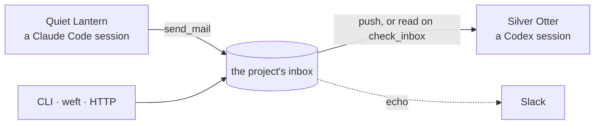

# agent-mail

Durable local mail and advisory coordination between coding-agent sessions.

You are running several coding agents at once, in different projects and
different tools. One of them finishes something another is waiting on. You
copy text from one session and paste it into another.

agent-mail is a local message bus for those sessions. A message lands in a
project's on-disk inbox (its spool) whether or not anyone is listening, and
reaches a Claude Code session in context when one is.



Sessions address each other by stable names across project directories.

- **Durable delivery.** A message waits in the project's inbox and is read
  when a session next attaches. Receipts record what happened to it.
- **Any endpoint.** Claude Code and Codex sessions get the same tools and
  inboxes; the CLI, an HTTP client, or a tool such as
  [weft](https://github.com/osteele/weft) reporting a finished job can send
  too.
- **Push into Claude Code.** With the channel enabled, mail arrives in a
  session's context without the agent asking.
- **Advisory coordination.** Path claims keep two agents from editing the
  same files, work leases record who is responsible for a logical unit, and
  lab-notebook experiment numbers (`EXP-NNN`) allocate atomically.
- **Inspectable traffic.** Unread state, threads, Slack echo, and web and
  Slack dashboards.

Claude Code's own cross-session messaging and agent teams cover the
all-Claude, all-live, spawned-together case without any of this;
[When to use Claude Code's built-ins](#when-to-use-claude-codes-built-ins)
maps the boundary.

## Quick start

Register agent-mail with the agents you use, in one command:

```bash
npx add-mcp github:osteele/agent-mail --args mcp --name agent-mail --global \
  --agent claude-code --agent codex
```

Sessions can then send mail, read their inbox, and take claims. The command's
only effect is the config entry:
[`add-mcp`](https://github.com/neon-solutions/add-mcp) writes each agent's
config file, and `npx` fetches agent-mail when a session starts it, so there
is no repository to clone and no background process to run.

Pass `mcp` through `--args`: add-mcp does not split a quoted command string
and silently writes a broken entry.

Name any other clients the same way (`--agent cursor --agent zed`, and so on);
`npx add-mcp list-agents` lists the twenty or so it knows. Every client gets the
same tools and the same durable inbox. Channel push is specific to Claude Code
and needs [its own setup](#enabling-channel-push-in-claude-code).

`--global` writes each agent's user-level config rather than the current
project, so a session in any directory stays reachable.

Requires Node 22.18 or later. Restart existing sessions afterward.

### Adding the daemon

An optional daemon adds [Slack echo](#connecting-to-slack), the
presence snapshot that keeps the [status line](#claude-code-status-line) fast,
and pruning of dead sessions without waiting for someone to run a command:

```bash
npm install -g github:osteele/agent-mail
agent-mail install
agent-mail status
```

Mail is delivered with or without it: when no daemon answers, a session writes
to the project's spool itself. The daemon is a background service, currently
macOS launchd, and nothing about delivery depends on it.

`agent-mail install` also registers agent-mail with Claude Code and Codex, so
it can replace the one-liner. Running both is harmless (an entry that
already points somewhere else is reported and left alone), but there is no
reason to.

**Platforms.** macOS and Linux are tested in CI. Windows is unsupported:
session liveness is read from `ps`, and without it the registry cannot prune
sessions or expire claims. See
[docs/decisions/0005](docs/decisions/0005-no-windows-support.md). Version
0.1.0, built for its author's machine first.

### Enabling channel push in Claude Code

The MCP tools and the durable inbox work as soon as the server is registered.
Channel push is a separate opt-in with three parts, all of which must line up.

It also needs a clone, unlike everything above: the plugin marketplace is a
directory in this repository, and `claude plugin marketplace add` takes a
local path.

1. **The marketplace added and the plugin installed**, which `agent-mail
   install` does not do for you:

   ```bash
   git clone https://github.com/osteele/agent-mail
   claude plugin marketplace add ./agent-mail
   claude plugin install agent-mail@osteele-local
   ```

2. **Channels enabled and this plugin allowed**, in managed settings
   (`/Library/Application Support/ClaudeCode/managed-settings.json`):

   ```json
   {
     "channelsEnabled": true,
     "allowedChannelPlugins": [
       { "marketplace": "osteele-local", "plugin": "agent-mail" }
     ]
   }
   ```

3. **Each session launched with the channel loaded:**

   ```bash
   claude --channels=plugin:agent-mail@osteele-local
   ```

   This is a per-launch decision, so set it once for every session instead of
   typing it each time. With a launcher wrapper, put it in global
   `extra_args`; scoping it to some paths leaves whole directories silently
   without push.

Run `agent-mail status` to see what is actually in place, and `agent-mail
listeners` to see which live sessions were launched with the channel: one whose
host was not is tagged `{channel:host-not-loaded}`.

Send a smoke-test message to the current project:

```bash
agent-mail notify --project "$PWD" --from cli --message "agent-mail is ready"
agent-mail inbox --project "$PWD"
```

### Updating and restarting

Installing the package puts the `agent-mail` command on `PATH`;
`agent-mail install` is the separate step that creates the launchd service and
registers agent-mail with Claude Code and Codex. It registers whichever copy
you ran it from, and with whichever runtime ran it, so the same command works
from an installed package and from a development checkout. `agent-mail
uninstall` removes only the audit hook and MCP registrations that belong to
this installation.

[docs/install.md](docs/install.md) covers the installer's edge cases: when an
existing entry is preserved, replaced, or left alone, and the plugin versus
user-scope registration conflict that silently discards channel pushes.

Restart every existing Claude Code and Codex session after an integration
change or an agent-mail code update. Each session owns a long-running MCP
process, so it does not load new tool schemas or server code automatically.
Restart the daemon after changing daemon code:

```bash
agent-mail restart
```

Daemon configuration changes do not require a process restart. Reload them
with `agent-mail graceful`.

## How delivery works

Claude Code, Codex, and any other MCP client load the same MCP server and use
the same tools and spools, and every sender (a session, the CLI, weft, an HTTP
client) is delivered the same way. The receiving client determines how soon a
message enters its context: a Claude Code session with channel push enabled
receives it unasked, and otherwise reads it on the next `check_inbox`; a Codex
session always reads on `check_inbox`, because Codex has no channel push.
Codex's MCP tools still register the session, send mail, inspect peers, read
and mark inbox messages, and manage claims. Messages remain available in the
project spool after delivery.

## Coordination

Three primitives, all advisory, and all filesystem transactions rather than
daemon state:

- **Path claims** reserve a file or directory before you edit it. Claim a
  multi-file edit set in one call so acquisition is atomic; a directory claim
  conflicts with every claim beneath it.
- **Work leases** record which session is responsible for a logical unit, such
  as executing a research plan. A lease never blocks a file edit, and a path
  claim never implies responsibility for the plan.
- **Experiment numbers** (`EXP-NNN`) are allocated atomically against a lab
  notebook, counting both existing files and outstanding reservations.

`list_coordination` shows all three together, with owners and conditions. When
an owning session dies, `recover_coordination` releases its record — but only
after agent-mail proves that exact process is gone.
[docs/architecture.md](docs/architecture.md#coordination-claims) specifies the
conflict rules, recovery, and transferring a lease between live sessions.

## Configuration

`~/.config/agent-mail/config.toml` holds the port, the Slack echo and
dashboard settings, session aliases, the inbound policy, and the rate,
deduplication, and expiry limits.
[docs/configuration.md](docs/configuration.md) is the reference.

### Connecting to Slack

An incoming webhook can mirror messages into a Slack channel. Create a Slack
app and enable [Incoming
Webhooks](https://docs.slack.dev/messaging/sending-messages-using-incoming-webhooks).
Then select **Add New Webhook to Workspace**. Choose the channel that should
receive agent-mail traffic, then copy the generated webhook URL. Treat this
URL as a secret.

Add the URL to `~/.config/agent-mail/config.toml`:

```toml
slack_webhook = "https://hooks.slack.com/services/..."
slack_echo = "all"
```

`AGENT_MAIL_SLACK_WEBHOOK` can supply the URL instead. agent-mail also falls
back to `SLACK_WEBHOOK` in `~/.config/weft/config` when neither setting is
present. Reload the daemon and send a test message:

```bash
agent-mail graceful
agent-mail notify --project "$PWD" --from cli --message "Slack connection test"
```

The webhook is enough for per-message echoes. The editable Slack dashboard
also uses the Web API. Add the [`chat:write`
scope](https://docs.slack.dev/reference/scopes/chat.write/) to the Slack app,
reinstall the app in the workspace, and invite its bot to the target channel.
Copy the Bot User OAuth Token and the channel ID into the same config file:

```toml
slack_bot_token = "xoxb-..."
slack_channel = "C0123ABCD"
```

Environment-variable equivalents are `AGENT_MAIL_SLACK_BOT_TOKEN` and
`AGENT_MAIL_SLACK_CHANNEL`. Post or refresh the dashboard with:

```bash
agent-mail slack-dashboard
```

### Claude Code status line

`agent-mail status-line` prints this session's display name, whether or not
anyone else is in the project. The name is the session's address: agents in
other projects refer to it by that name. It prints nothing only when the
payload carries no session id.

`--fields` prints one tab-separated line instead: the name, peer count, unread
messages, `push`/`pull` for whether mail reaches this session on its own, and
unprocessed weft jobs this session submitted. A status line can then show all
five from a single invocation, rather than reimplementing agent-mail's
registry and spool semantics in shell. Fields are only ever appended, so a
consuming script can split positionally.

It reads Claude Code's [statusLine](https://code.claude.com/docs/en/statusline)
JSON payload on stdin, taking the session ID and project directory from it. Add
it to your status line script:

```bash
#!/bin/bash
# Claude Code closes stdin when it is done, so `cat` returns. The tty check
# keeps a manual invocation from blocking.
input=""
[ -t 0 ] || input=$(cat)

cwd=$(printf '%s' "$input" | jq -r '.workspace.current_dir // .cwd // empty')

# Forward the payload already captured because stdin was consumed above.
session=""
if [ -n "$input" ] && command -v agent-mail >/dev/null 2>&1; then
    session=$(printf '%s' "$input" | agent-mail status-line 2>/dev/null)
    [ -n "$session" ] && session=" · $session"
fi

printf '%s%s\n' "${cwd/#$HOME/\~}" "$session"
```

```
~/code/agent-tools/agent-mail · Quiet Lantern
```

Then point `statusLine` at it in `~/.claude/settings.json`:

```json
{ "statusLine": { "type": "command", "command": "bash ~/.claude/statusline.sh" } }
```

[docs/status-line.md](docs/status-line.md) specifies the `--fields` output and
collects advice for the script itself: the timing budget, multi-row output,
sizing with `$COLUMNS`, and what the push/pull and weft-jobs fields mean.

## Dashboards

The daemon serves a read-only dashboard at `http://127.0.0.1:8377/`: live
sessions, coordination health, sender-to-recipient traffic, and a flight log.
`agent-mail dashboard --open` opens it, and starts a filesystem-backed fallback
server when the daemon is down. `agent-mail slack-dashboard` posts the same
summary into Slack and edits that message in place on later runs, which needs
the bot token rather than the webhook.
[docs/dashboards.md](docs/dashboards.md) covers both.

## Security

The daemon binds 127.0.0.1, so any process running as the local user can submit
text. All inbound mail is explicitly marked untrusted and cannot approve
permissions or override the receiving session's rules. Use `hold` or `refuse`
for sessions that should not accept agent-mail automatically, and do not expose
the port.

## When to use Claude Code's built-ins

Claude Code ships two things that overlap with agent-mail.

**[Cross-session messaging](https://code.claude.com/docs/en/cross-session-messaging)**
(`ListAgents` and `SendMessage`, Claude Code 2.1.224) sends a message to a
named, running Claude session on the same machine. It needs no daemon and no
configuration. For a direct message to a live Claude session, use it.

**[Agent teams](https://code.claude.com/docs/en/agent-teams)** (experimental,
off by default) let one session spawn teammates that share a task list and
message each other through per-agent mailboxes, with file locking on task
claims. For parallel work you are launching now, under one lead, in one
project, use it.

Use agent-mail when the shape is different in one of these ways:

- **You started the sessions yourself.** Agent teams have a
  lead and teammates for the lead's lifetime, one team per session. agent-mail
  addresses peers that started independently, in their own projects, with no
  hierarchy and nothing to promote or transfer.
- **Not every endpoint is Claude Code.** Codex sessions use the same tools and
  the same inboxes. So do the CLI, weft, and any HTTP client.
- **The recipient may not exist yet.** A message, whether addressed to one
  session or broadcast to the whole project, waits in the project's inbox and
  is read when a session next attaches. A team's config is removed when its
  session ends.
- **The unit of coordination is a file or a plan, not a task.** Path
  claims express edit exclusion, work leases express who is responsible for a
  logical unit, and the two are deliberately separate.
- **The traffic is inspectable.** agent-mail keeps unread state,
  threads, and receipts, echoes to Slack, and serves dashboards.

Where Claude Code's built-ins overlap with agent-mail, they are the better
choice: they need no daemon, no channel flag, and no second inbox to reason
about. If your sessions are all Claude Code, all spawned together, and all
still running, you probably do not need this.

### Auditing native SendMessage

The transports coexist: by default a native `SendMessage` does not pass
through agent-mail, so it does not appear in the spool, Slack, or dashboards.
Install the optional audit hook with `agent-mail install --native-audit` to
record successful native `SendMessage` calls in the sender's
agent-mail log and Slack echo. Audit records are never delivered through an
agent-mail inbox, which prevents the hook from creating a second delivery or a
message loop. The hook observes all `SendMessage` calls, including subagent and
agent-team messages, and records the destination exactly as Claude supplies it.
It is added to `~/.claude/settings.json` (or `$CLAUDE_CONFIG_DIR/settings.json`)
without replacing other hooks.

## Reference

- [docs/cli.md](docs/cli.md) — every subcommand and flag. `agent-mail help`
  prints a compact version of the same listing.
- [docs/configuration.md](docs/configuration.md) — every config key.
- [docs/status-line.md](docs/status-line.md) — the `--fields` output, the
  timing budget, and multi-row status lines.
- [docs/http-api.md](docs/http-api.md) — the daemon's HTTP endpoints, for
  automations that should not shell out to the CLI.
- [docs/automation.md](docs/automation.md) — the read-only machine-readable
  state outputs.
- [docs/install.md](docs/install.md) — what the installer preserves, replaces,
  and leaves alone.
- [docs/architecture.md](docs/architecture.md) — how agent-mail works
  underneath.
- [docs/decisions/](docs/decisions/README.md) — why it works that way.

## Development

Development setup, the Bun/Node runtime split, and the build are in
[DEVELOPMENT.md](DEVELOPMENT.md).
[docs/architecture.md](docs/architecture.md) covers how agent-mail works
underneath.

## Related projects

[agent-lore](https://github.com/osteele/agent-lore) is a related project:
mail carries something one session needs to tell another now, while lore is
where a session records what it worked out for whoever comes next. If you
find yourself sending the same explanation to a third agent, that is the
boundary.

Both sit in a wider set of agent infrastructure, listed at
[osteele.com/software/agent-tools](https://osteele.com/software/agent-tools).

## License

MIT. See [LICENSE](LICENSE).
