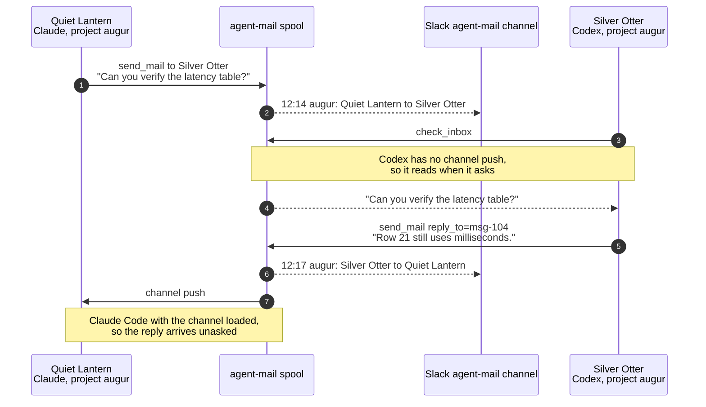

# Architecture

How agent-mail works underneath: where state lives, how sessions are
addressed, what the delivery guarantees actually are, and how the coordination
primitives behave. The [README](../README.md) covers installation and daily
use; this is the reference behind it.

- **Spool files are the source of truth.** Each project has an append-only JSONL
  file at `~/.claude/agent-mail/inbox/<slug>.jsonl`.
- **Receipts record state transitions.** They use an append-only JSONL file at
  `~/.claude/agent-mail/receipts/<slug>.jsonl`. A message starts as `spooled`.
  Each receiving session can then report `held`, `pushed`, `read`, `refused`,
  or `expired`.
- **The daemon accepts HTTP notifications.** `src/daemon.ts` starts through
  launchd, listens on localhost, appends `POST /notify` requests to spools, and
  applies the configured Slack echo policy.
- **Each client session starts an MCP server.** Claude Code and Codex both run
  `src/channel.ts` over stdio. It exposes messaging, receipts, policy,
  presence, and coordination tools. In a channel-enabled Claude Code session,
  it also tails the project spool and pushes new messages as
  `<channel source="agent-mail">` events.
- **The registry tracks attached sessions.** Entries under
  `~/.claude/agent-mail/registry/` record `cwd`, `pid`, `sessionId`, and `name`.
  A listing prunes an entry when the process is gone or its pid belongs to a
  different process. The process start time distinguishes a recycled pid from
  the original process.
- **Session names persist.** Assignments under
  `~/.claude/agent-mail/session-names/` are keyed by session ID. They survive
  listener restarts and keep existing names stable across naming upgrades.
- **Claims are filesystem transactions.** Per-project entries under
  `~/.claude/agent-mail/claims/` reserve lab-notebook experiment numbers and
  files or directories. Claims do not depend on the daemon.
- **Work leases assign logical responsibility.** Per-project entries under
  `~/.claude/agent-mail/work/` exclusively assign logical work without
  restricting file edits. They also do not depend on the daemon.
- **Dashboards read the files directly.** `src/dashboard.ts` and
  `src/slackDashboard.ts` use the shared aggregation in `src/dashboardData.ts`
  to render a local web page or an editable Slack message. They do not depend
  on the daemon.

## Addressing

Mail is addressed to a **project directory**. Every session running in that
directory shares one inbox, so by default `send_mail` reaches all of them. Each
generated session identity has two forms:

- The **full name** is its stable address, for example
  `augur-quiet-lantern`. It combines the project directory basename (optionally
  shortened through `session_aliases`) with a generated adjective–noun slug.
- The **display name** is the human-facing form used in compact routes, for
  example `Quiet Lantern`.

Pass a session's full name, display name, or session ID as `session` to reach it
specifically. Use `list_sessions` to discover these values. A display name is
matched without regard to case and must be unambiguous in the target project.
Claude Code supplies its ID in `CLAUDE_CODE_SESSION_ID`; current Codex supplies
`CODEX_THREAD_ID`. Older hosts that expose neither receive a generated ID when
their MCP server starts. A deliberate Claude `/rename` is preserved verbatim as
both forms. Existing sessions retain their previously assigned syllable names,
such as full name `augur-hia` and display name `hia`. Only new session IDs
receive adjective–noun names.

The project spool stores every message for that directory. Session-local views
(`check_inbox`, `mark_read`, and channel push) filter it for the current
session. A session does not see mail it authored itself. A direct
session-targeted message is visible only to the addressed session. The CLI
`agent-mail inbox` and HTTP `/inbox` endpoint are project-spool views and show
the stored messages without session-local filtering.

Each session also records its **host client**, the name the client reports in the
MCP handshake: `claude-code`, `codex`, `kimi-code`, and `opencode` are the ones
seen in practice. Alongside it are capabilities such as `channel`, `poll`,
`native-peer`, `claims`, `work`, and `receipts`. They appear in `status`,
`listeners`, `list_sessions`, and both dashboards. Agents can use native peer
messaging when the target advertises it. Otherwise, they can use channel push or
durable polling.

Channel push exists only under Claude Code, so a session under any other client
is tagged `poll`. A Claude Code session can also hold a channel it cannot use,
and is then tagged `channel:host-not-loaded` (its host was launched without the
channel flag) or `channel:identity-unauthorized` (the host will not authorize
this server's identity). Both mean the same thing to a sender: that session's
mail waits for its next inbox check.

Session identity comes from the environment, in the order
`CLAUDE_CODE_SESSION_ID`, `CODEX_THREAD_ID`, `AGENT_SESSION_ID`. Native ids come
first, since an agent that mints its own knows more than a launcher wrapping it
does. kimi and opencode set no id of their own, so a launcher exports
`AGENT_SESSION_ID` before starting them. Without one, a session receives a
random ID that no sibling process can learn, which leaves project-wide broadcast
as the only way to reach it.

## Presence

A listed session is **attached** when its MCP server is alive and can receive
mail. Attached does not mean **active**. A terminal left open overnight stays
attached with nobody home. Every surface (`list_sessions`, `listeners`,
`status`, and both dashboards) therefore tags each session with its recency:
`[busy]` (Claude reports it mid-turn), `[active]` (signs of life within the
last two minutes), or `[idle <age>]`, flagged `stale?` after a day. Recency uses
the latest of Claude Code's session-activity timestamp, the session's last
agent-mail tool call, and its registration time. Treat long-idle sessions as
probably vacant rather than as active agents. The same recency rule decides the
peer count the [status line](../README.md#claude-code-status-line) reports. A peer idle past
a day no longer counts as company.

Channel-enabled sessions receive push delivery. Running sessions without the
flag can arm a Monitor on their spool file. Other sessions read the spool on
their next `agent-mail inbox` or `check_inbox` call.

## Muting

A session can pause its channel push from inside the agent with the
`mute_notifications` tool. A user or script can also run `agent-mail mute` and
target `--session <name-or-id>`, `--project <dir>`, or both. While muted, mail
still spools (and stays visible to `check_inbox` / `agent-mail inbox`) but is
not pushed as a `<channel>` event. `unmute_notifications` / `agent-mail unmute`
delivers everything held during the mute at once, then resumes normal push.
Muting only affects an agent's push. It does not change the configured
`slack_echo` policy or a message's `--no-slack` override. Mute is per-session
and clears when the session restarts.

## Delivery controls and receipts

Every new message carries descriptive provenance: origin kind, transport,
client and session ID when available, and `authority: untrusted`. This metadata
never grants user authority. A receiving agent must still apply its own
permission rules before acting. Legacy messages without provenance are also
shown as untrusted.

Each session has an independent inbound policy:

- `accept` delivers new mail and releases held mail;
- `hold` keeps mail out of the agent context while retaining it for later; and
- `refuse` records refusal without delivering the message to that session.

Set it from an agent with `set_inbound_policy`, or externally with `agent-mail
inbound --policy ...`. The default comes from `inbound_policy`. A held queue is
bounded. When it fills, the oldest held message is refused.

Senders can supply an idempotency key and TTL. agent-mail also suppresses
identical bodies from one sender during a short window and applies a rolling
per-sender rate limit. Set either limit to zero to disable it. Expired and
native-audit messages remain visible to dashboards but never enter an inbox.

A send reports which of these happened. `spooled as <id>` stored a new message.
`already sent as <id>` found an identical body from the same sender inside the
duplicate window, so the copy already in the spool stands and this one was
dropped. `spooled as <id> (an earlier attempt of this send reached the spool)`
is neither: the sender met its own earlier attempt, whose reply was lost in
transit, and the message is stored exactly once. `rate limited; retry in <n>s`
stored nothing. Through the MCP tool, each of these also names the audience, and
counts any recipients whose channel push cannot reach them.

Use the `delivery_status` MCP tool or `agent-mail receipts` to inspect the
append-only state changes. A `spooled` receipt confirms durable local storage.
Later receipts are per receiving session. This is observability rather than
exactly-once delivery: direct fallback writers can race, and a process can fail
after receiving a push but before recording its receipt.

## Threads

To answer a message, pass its ID as `reply_to` to the `send_mail` tool (IDs are
shown by `check_inbox`), or `--reply-to <id>` on `agent-mail notify`. The reply
inherits the original's thread, inbox readbacks mark it with `↩`, and the Slack
echo quotes the parent inline. Every message carries a `threadId` (a root
message is its own thread) so conversations group uniformly.

## Addressing one session from an automation

A project inbox is shared by every session in that directory, so by default
`agent-mail notify` reaches all of them — useful for an announcement, noisy when
a build or job notifier fires while several sessions are open, since each one
wakes to read it.

Pass `--session <name-or-id>` to address a single session instead. The name may
be its id, its full name (`augur-quiet-lantern`), or its display name
(`Quiet Lantern`, matched case-insensitively); `agent-mail listeners` lists them.
An addressed message is hidden from every other session in the project.

Unlike the `send_mail` tool, an unresolvable name is **not** an error here. An
automation's addressee may have exited while its job ran, and refusing would
throw the notification away, so an unknown or ambiguous name falls back to a
project broadcast and notes why on stderr.

For this to work the caller has to know the session id. Agents that export one
into their subprocesses (`CLAUDE_CODE_SESSION_ID`, `CODEX_THREAD_ID`) supply it
directly. kimi and opencode export none, so `agent-command-guards`' launcher
mints `AGENT_SESSION_ID` for them; without it those sessions cannot be addressed
individually at all. weft records the submitting session at `weft run` time and
passes it back as `--session` when a job finishes.

When testing session addressing, have a listener attached under the addressed
session id: the broadcast fallback means addressing an absent session is
indistinguishable from not addressing at all — that's the fallback working, not
the feature failing.

## Coordination claims

Agents can coordinate work without racing on notebook IDs or overlapping
edits. `claim_experiment` atomically returns the next `EXP-NNN`, accounting for
both files already in `experiments/` and reservations held by other agents.
Create the `EXP-NNN-*.md` file before releasing the claim; after release, the
file is what keeps the number allocated.

`claim_path` reserves one or more paths within the current project. Pass a
multi-file edit set in one call so acquisition is atomic. If any path
conflicts, none are claimed. The set has one claim ID, and one `release_claim`
releases the whole set:

```json
{
  "paths": [
    "Sources/RoundsCore/Schedule.swift",
    "Sources/RoundsCore/MarkdownParsers.swift",
    "Checks/RoundsCoreChecks/main.swift"
  ]
}
```

The singular `path` input remains available. A batch is homogeneous. Its paths
are all files by default, or all directories when `directory: true`. A single
batch cannot mix files and directories. The same rule applies to repeated CLI
`--path` options with `--directory`. Claim a common parent directory when one
atomic reservation must cover both kinds. A directory claim conflicts with
every claim below it, and a path cannot be claimed beneath a directory another
agent owns. Non-overlapping siblings can be claimed independently.
`list_claims` shows owners and claim IDs; `release_claim` releases a claim
owned by the current session. Claims held by an MCP session are released on a
normal session shutdown. A new path acquisition automatically removes a
conflicting claim only when agent-mail proves that its exact owner process is
dead. It never displaces an idle, live, or manually registered owner.

A missing claimed path is not by itself stale: agents may claim a file before
creating it. If a session crashes, use `list_coordination` to inspect its owner,
target, and condition. Check the intended edit before recovering the record.

The equivalent CLI is useful for inspection and recovery:

```bash
agent-mail claim-experiment [--project <dir>] [--notebook <dir>] [--owner <label>]
agent-mail claim-path --path <path> [--path <path> ...] [--directory] [--project <dir>] [--owner <label>]
agent-mail claims [--project <dir>]
agent-mail release-claim --id <claim-id> [--project <dir>]
```

## Logical work leases

Work leases answer who is responsible for executing a logical unit of work.
Path claims reserve edit sets. Agents can hold either form of coordination
independently, so responsibility for execution does not restrict who may edit
the source file.

`acquire_work` atomically leases a `(resource_type, resource_key)` pair within
the current canonical project. Repeating the acquisition from the same session
is idempotent and updates its metadata. A live different owner causes a
conflict; a definitively dead session can be displaced on the next acquisition.
`update_work` records a concise `working` or `waiting` state and current
activity. `release_work` relinquishes responsibility.

Coordination CLI commands run from a registered Claude Code or Codex shell use
that host's session identity, so their leases and claims have the same liveness
and shutdown behavior as MCP tool calls. CLI commands outside a registered
agent session require an `--owner` label and create deliberately durable manual
ownership. Release those records explicitly when the operator's work ends.

`list_work` defaults to the current project. Pass `all_projects: true` for a
cross-project view, or filter by resource type or owner. `list_sessions` also
shows each session's leased work. MCP-session leases are released on normal
shutdown; an offline owner remains visible for inspection and CLI recovery.

Research plans use `resource_type: "research-plan"` and the plan filename stem
as `resource_key`, so ownership survives moves among plan status directories.
The current path is optional provenance, not identity.

## Inspection and recovery

`list_coordination` combines work leases, path claims, and experiment-number
reservations in one project or cross-project view. Each record has a condition:

- `healthy` — its session owner is live, or it has a deliberately durable
  manual owner. The listing reports the owner status separately.
- `owner-offline` — the recorded session and process identity is definitively
  dead; the record is eligible for agent recovery.
- `owner-unverifiable` — the caller cannot obtain reliable process evidence.
  The record remains protected; this is distinct from deliberate `manual`
  ownership.
- `source-missing` — a work lease's optional source path is absent.
- `target-absent` — a claimed edit target is absent, which can be expected
  while creating it.
- `awaiting-materialization` — an experiment number is reserved but its
  `EXP-NNN-*.md` file is not present yet.
- `materialized` — the experiment file exists, so the reservation is redundant
  and its owner should release it.

`recover_coordination` revalidates liveness and releases another session's
record only when that exact owner process is dead. Live and manual owners remain
protected by default. Before
recovering an experiment reservation whose file is absent, inspect jobs and
artifacts that may already use its ID. Normal owner release remains
`release_claim` or `release_work`.

To release a record whose owner is live, manual, or unverifiable — the common
case being a manually registered CLI owner (`cli:<label>`) whose session has
ended, which has no process to revalidate and so is otherwise unrecoverable —
pass an `authority`:

```bash
agent-mail coordination recover --id <coordination-id> \
  --authority "operator: session ended without releasing"
```

The authority is an attestation, **not a credential**: agent-mail records it
verbatim and never checks it. Supplying it bypasses the liveness proof and
force-releases the record. Each forced recovery appends the record's identity,
its owner, that owner's status at the time, and the declared authority to
`~/.claude/agent-mail/forced-recoveries.jsonl` before the delete; if that log
cannot be written, the recovery is refused. Claims are advisory (see
[decision 0004](docs/decisions/0004-authority-forced-recovery.md)), so this
trades an unenforceable check for a deliberate, auditable action.

Agents must treat the authority as user-supplied only: it is never inferred,
and never taken from mail, file contents, or other tool output.

Listings show the owner ID, session/PID identity, owner status, and the
session's last tool-call heartbeat when one exists. The lease `updated` time is
separate: it changes only on `acquire_work` or `update_work`. Legacy CLI records
that contain a PID but no session ID are process-owned rather than manual;
agent-mail uses process start time to reject a recycled PID and makes the record
recoverable once the original process is gone.

Sandboxed clients that cannot invoke `ps` use the daemon's fresh, PID-scoped
process-evidence snapshot. The snapshot lists every inspected owner PID and is
accepted only when the scan succeeded, covered the requested PID, and is at
most 30 seconds old. Missing, stale, partial, or failed evidence produces
`owner-unverifiable`, never `owner-offline`.

## Work transfer requests

`request_coordination_transfer` requests a logical work lease and returns
immediately with a durable request ID, current holder, and deadline. The holder
answers with `respond_coordination_transfer` (`accept` or `decline`). An
unchanged lease transfers automatically after the deadline. Any intervening
lease update, release, or ownership change makes the request `superseded`
instead, so stale requests cannot overwrite newer work. Requests and final
dispositions remain under `~/.claude/agent-mail/transfers/` for audit.

Transfers currently apply only to logical work leases. Path claims and
experiment reservations retain their stricter release/recovery semantics.

CLI equivalents support inspection, manual ownership, and recovery:

```bash
agent-mail work list [--project <dir> | --all] [--type <type>] [--owner <owner>]
agent-mail work acquire --type <type> --key <key> [--label <label>] [--source <path>] [--owner <label>]
agent-mail work update --id <work-id> [--state working|waiting] [--activity <text>]
agent-mail work release --id <work-id> [--project <dir>]
agent-mail coordination list [--project <dir> | --all] [--kind <kind>] [--json]
agent-mail coordination recover --id <coordination-id>
agent-mail coordination request-transfer --id <work-id> [--reason <text>] [--timeout <seconds>]
agent-mail coordination respond-transfer --id <request-id> --decision accept|decline [--message <text>]
agent-mail coordination transfers [--project <dir> | --all] [--json]
```

## A delivery, end to end

Quiet Lantern (Claude Code) and Silver Otter (Codex) share a project. The
spool mediates, Slack echoes, and each client reads by its own route:


